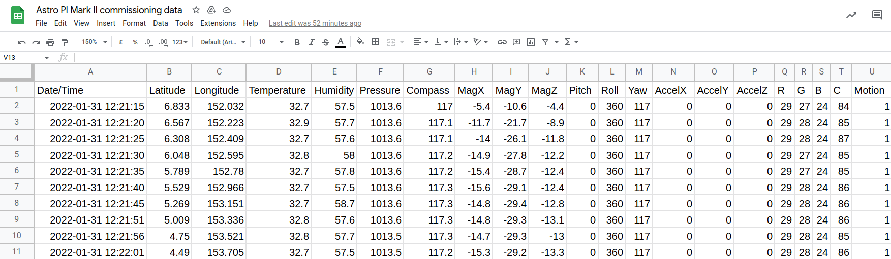
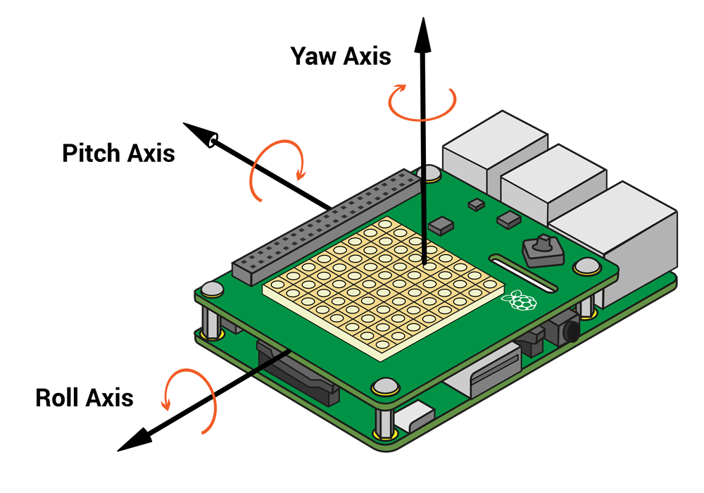

## CSV files


If you have completed the [Sense HAT data logger](https://projects.raspberrypi.org/en/projects/sense-hat-data-logger/) project you will finish with a large Comma Seperated Value (CSV) file, ready to be looked at.

Alternatively you might have completed the [Astro Pi Mission Space Lab](https://astro-pi.org/mission-space-lab/guidelines/life-in-space) challenge and have a CSV to analyse once your data has been returned from the International Space Station.

--- collapse ---
---

title: What's in a CSV files?

---

A CSV file contains lines of data seperated by commas. Usually there is also a header row in a CSV file as well, which describes the data. CSV files are an excellent way of storing tables of data, but they can be hard for humans to read through.

Here is an example of two lines from a CSV file, with the header row and the first line of data.

```
Date/Time,Latitude,Longitude,Temperature,Humidity,Pressure,Compass,MagX,MagY,MagZ,Pitch,Roll,Yaw,AccelX,AccelY,AccelZ,R,G,B,C,Motion
2022-01-31 12:21:15,6.833,152.032,32.7,57.5,1013.6,117,-5.4,-10.6,-4.4,0,360,117,0,0,0,29,27,24,84,1
```

Here's the same data but in a table, making it a little easier to read.

| Date/Time | Latitude | Longitude | Temperature | Humidity | Pressure | Compass | MagX | MagY | MagZ | Pitch | Roll | Yaw | AccelX | AccelY | AccelZ | R | G | B | C | Motion |
| --- | --- | --- | --- | --- | --- | --- | --- | --- | --- | --- | --- | --- | --- | --- | --- | --- | --- | --- | --- | --- |
| 2022-01-31 12:21:15 | 6.833 | 152.032 | 32.7 | 57.5 | 1013.6 | 117 | -5.4 | -10.6 | -4.4 | 0 | 360 | 117 | 0 | 0 | 0 | 29 | 27 | 24 | 84 | 1 |

--- /collapse ---

To make the data in a CSV easy to read and analyse, it can be opened using a spreadsheet application. The example below uses Google Sheets, but the process is similar for other applications.

--- task ---

Download this [CSV file](https://github.com/raspberrypilearning/astro-pi-flight-data-analysis/raw/master/en/resources/Astro%20PI%20Mark%20II%20commissioning%20data%20-%20IR.csv), which contains data captured from one of the flight units onboard the ISS.

--- /task ---

--- task ---

Use your spreadsheet application to **Open** or **Import** the downloaded file. You should see something like this:



--- /task ---

If you wanted to collect motion data for the Astro Pi Flight Unit, then have a look at the collapsed section below.

[[[astro-pi-pir]]]

--- collapse ---
---

title: What do the headings mean

---
Column name|Meaning
---|---
Date/Time|The date and time at which the measurements were taken
Latitude|The north-south position of the ISS
Longitude|The east-west position of the ISS
Temperature|The temperature in the ISS in °C
Humidity|The % relative humidity
Pressure|Air pressure in *millibars*
Compass|The direction of magnetic north
MagX|The magnetic field strenght on the X axis
MagY|The magnetic field strenght on the Y axis
MagZ|The magnetic field strenght on the Z axis
Pitch|The pitch of the flight unit
Roll|The roll of the flight unit
Yaw|The raw of the flight unit
AccelX|The acceleration along the X axis
AccelY|The acceleration along the Y axis
AccelZ|The acceleration along the Z axis
R|The amount of red light incident on the flight unit
G|The amount of green light incident on the flight unit
B|The amount of blue light incident on the flight unit
C|The amount of all light incident on the flight unit
Motion|Whether or not motion near the flight unit has been detected



--- /collapse ---

There is an excellent guide to help you understand the sensors [here](https://projects.raspberrypi.org/en/projects/getting-started-with-the-sense-hat) if you need to familiarise yourself.

