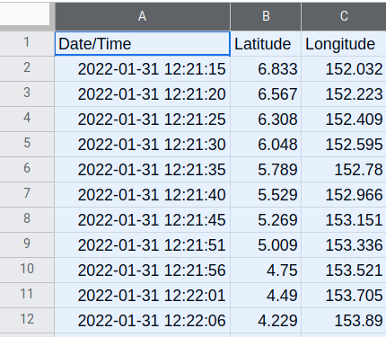
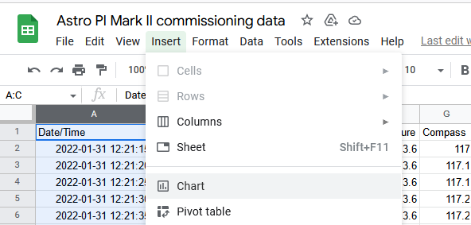
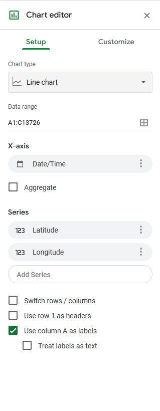
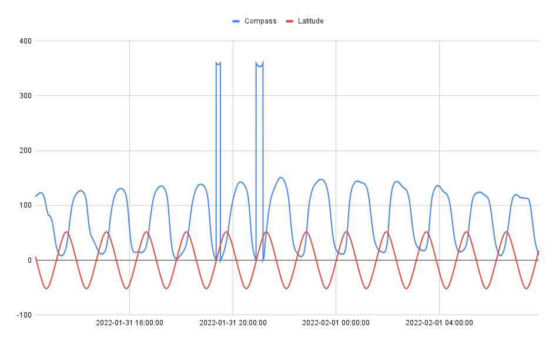
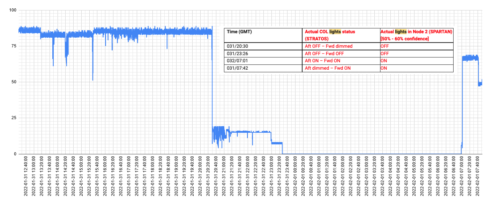
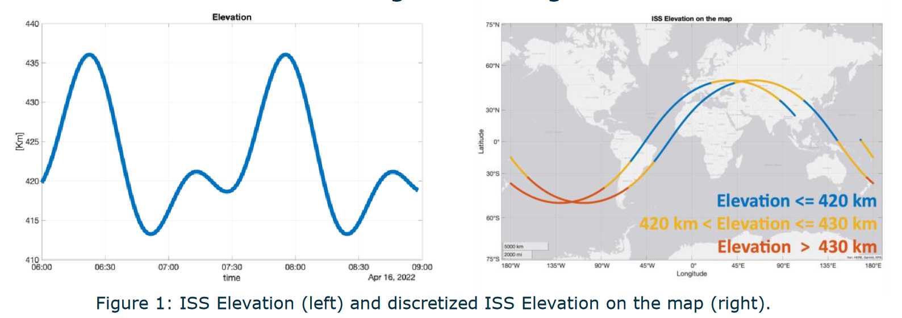

## Analyse the data

The easiest way to analyse the data is to draw some graphs, and then look for patterns or anomolies that you might find.

You can select columns of data in a spreadsheet and then use that data to draw a graph.

--- task ---

Select the columns of data that you want to graph.

--- /task ---

--- task ---

From the **Insert** menu select **Chart**

--- /task ---

--- task ---

Use the **Chart editor** to change the **X-axis** and **Series** of the chart. In this case the X-axis has been changed to **Date/Time** and the **Latitude** and **Longitude** are being plotted along the **Y-axis**.

--- /task ---

This is the result from the data used so far.

You can clearly see cyclical orbit of the ISS in this graph and by fine tuning the time axis, use it to calculate that the ISS orbits the planet about once every 90 minutes.

--- task ---

Experiment with looking at the data, comparing different sets compared each other or over time.

This is a comparison of the **latitude** and **compass** readings. Although there is a very expected cyclical cycle between latitude and magnetic north readings as the the ISS gets closer and further away from the North Pole, there are two distinct anomalies in the data. These could be due to a technical error, or might be more interesting and worthy of investigation.

This is a graph using the colour sensor that correlates with when the crew dimmed the lights on the ISS.

--- /task ---

Python also has a graph plotting library called [matplotlib](http://matplotlib.org/), which can be used to make great-looking graphs. Have a look at the guide [here](https://github.com/raspberrypilearning/astro-pi-flight-data-analysis/blob/master/graphing.md) to get started.

