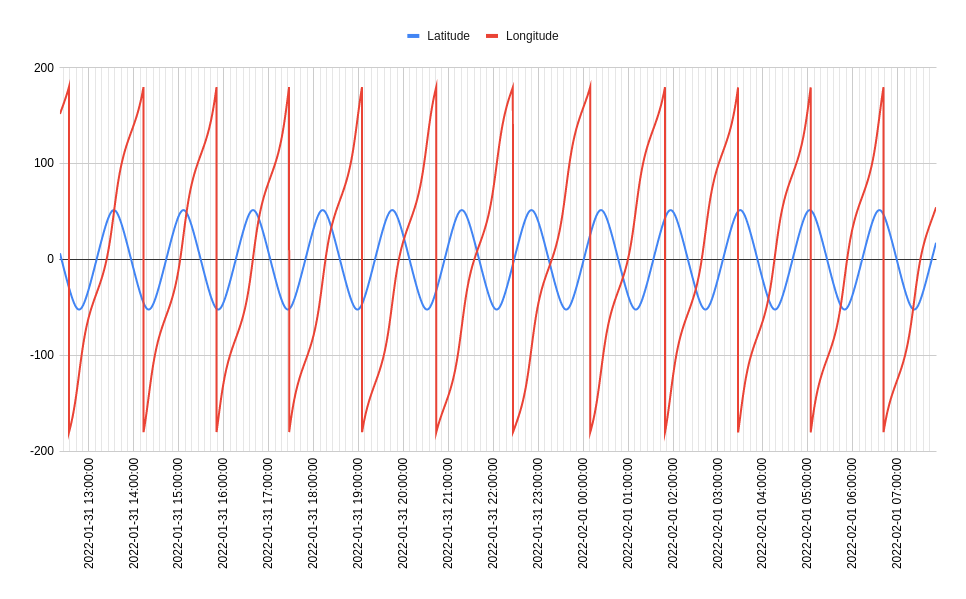

## How do I analyse the data?

The easiest way to analyse the data is to draw some graphs, and then look for patterns or anomolies that you might find.

- Short answer: any way you like!

- Long answer:

There is no single correct way; there are many ways you can go about it. The easiest way, though, is to choose one or two sensors and use the *chart* function of your spreadsheet software to plot their columns on a line graph against the timestamp: here's an [example](https://github.com/raspberrypilearning/astro-pi-flight-data-analysis/blob/master/spreadsheet.md) using LibreOffice Calc on the Raspberry Pi. Then you can visually inspect the lines for sudden, drastic or gradual changes. Try to think about what would be causing them.
  
If you need help here, just go onto [YouTube](https://www.youtube.com/) and search for *how to plot a line graph in Excel*, for example.

Python also has a 2D plotting library called [matplotlib](http://matplotlib.org/), which can be used to make great-looking graphs. Have a look at the guide [here](https://github.com/raspberrypilearning/astro-pi-flight-data-analysis/blob/master/graphing.md) to find out how.
  
You could also look into using analytical software packages like [Mathematica](https://www.wolfram.com/mathematica/) or [MATLAB](http://uk.mathworks.com/), both of which are free on the Raspberry Pi. It may be possible to produce some really interesting visualisations of the data using these.
  
The timestamp column could also be used to [look up](http://www.isstracker.com/historical) the location of the ISS, to add a geographical dimension to your analysis. There will be enough data to give you good global coverage, and you may be able to show that some sensor readings are affected by the location of the station.
  
You could even write code to automatically search for interesting or anomalous readings, to speed up the process.

