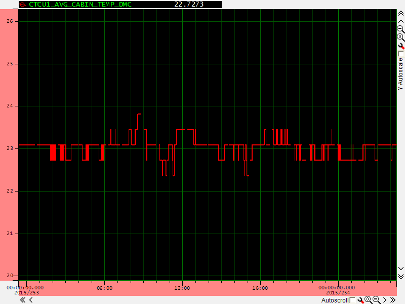
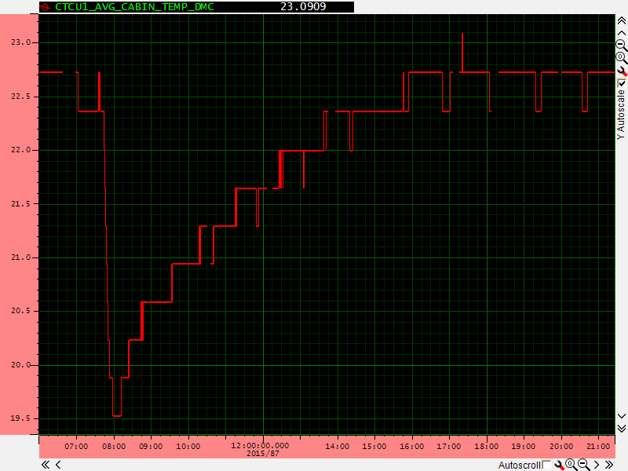
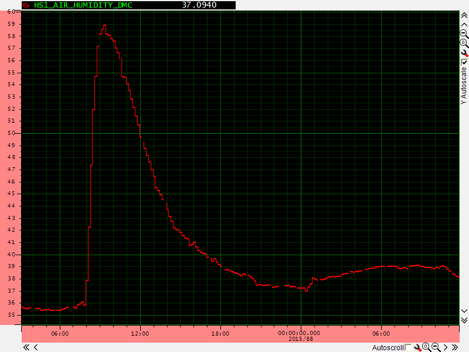
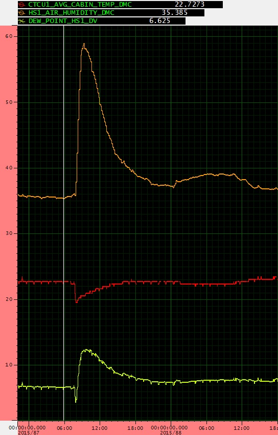
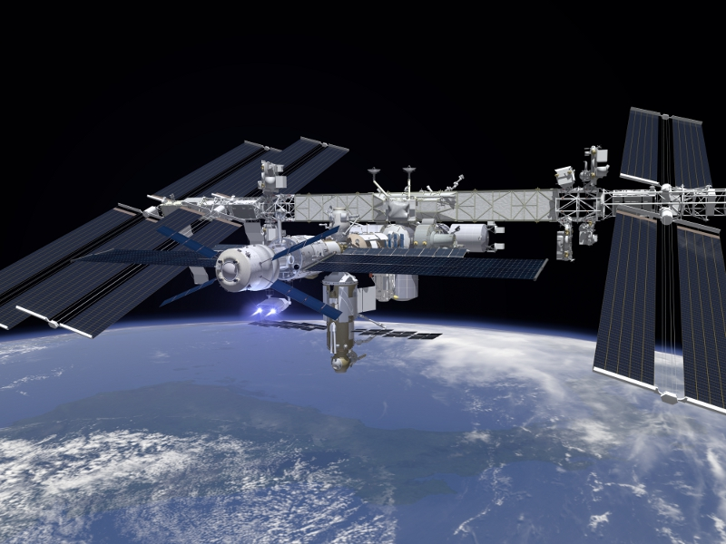
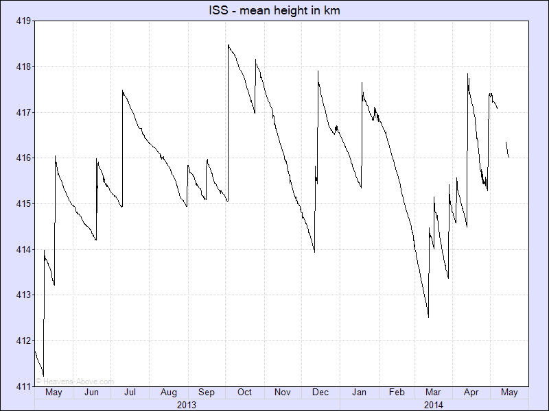

## What to look for

Thanks to the [German Aerospace Center](http://www.dlr.de/) and the [UK Space Agency](https://www.gov.uk/government/organisations/uk-space-agency), we have obtained some example sensor readings from the ISS life support system. These show what certain human activities will look like when plotted on a graph, so that you can look for something similar in the Astro Pi data.

### Crew activity

Hard work is part of daily life in space for astronauts. Their bodies naturally radiate heat, and through perspiration or breathing they release moisture into the air that increases relative humidity. Because of this, [humidity](https://projects.raspberrypi.org/en/projects/astro-pi-guide/sensors/humidity.md) and [temperature](https://projects.raspberrypi.org/en/projects/astro-pi-guide/sensors/temperature.md) are two great indicators of crew activity. The graph below shows the crew deploying the Muscle Atrophy Research and Exercise System ([MARES](http://www.esa.int/Our_Activities/Human_Spaceflight/Columbus/Muscle_Atrophy_Research_and_Exercise_System), a big zero-g exercise machine) in the Columbus module.

Time is on the horizontal axis, with relative humidity on the vertical. They start working at 9:00 and you can see that relative humidity starts to increase. They go on their lunch break at about 12:30 and some more work starts around 16:30.

The next graph shows the temperature for the same activity. You can see there is some variation around the time when the crew are working, but the change is only minor at less than one degree. So you should perhaps consider temperature as a less reliable indicator of crew activity.

Time is on the horizontal axis, with temperature on the vertical.

### CHX dry-outs

CHX stands for Cabin Heat Exchanger, which is a machine that's responsible for keeping the internal temperature of the ISS comfortable for the crew to live and work in. The CHX *core* is a consumable item that needs to be replaced once every six weeks or so. Because the core has water flowing through it constantly, regular dry-outs are required to prevent microbial or fungal growth that could damage the machine or pose a health risk to the crew. So a *CHX dry-out* is the name of the maintenance activity where they change from one CHX core to the next.

During this maintenance, the water flowing through the CHX core is diverted to a backup unit, to allow the core to dry out so that it can be replaced. This causes a drop in cabin [temperature](https://projects.raspberrypi.org/en/projects/astro-pi-guide/sensors/temperature.md), which reduces how much moisture can be suspended in the air, which in turn increases relative [humidity](https://projects.raspberrypi.org/en/projects/astro-pi-guide/sensors/humidity.md). The temperature plot below shows the dry-out starting at about 07:45.

Time is on the horizontal axis, with temperature on the vertical.

At the same time a marked increase in relative humidity is recorded, due to the cooler air being less able to suspend water vapour. Time is on the horizontal axis, with relative [humidity](https://projects.raspberrypi.org/en/projects/astro-pi-guide/sensors/humidity.md) on the vertical.

Note how long it takes for the measurements to get back to normal. These events should be easy to spot in the data if you look at temperature and humidity together. The plot below also shows [dew point](https://en.wikipedia.org/wiki/Dew_point), which you can calculate (if you want to) using this simple [formula](https://en.wikipedia.org/wiki/Dew_point#Simple_approximation).

### O2 re-pressurisation 

This occurs when they top up the oxygen supply on board the ISS. O2 re-pressurisation is also a regular maintenance activity that happens once every few months. The ISS has an oxygen recycling and carbon dioxide scrubbing system, but a bottle of compressed oxygen is periodically delivered to the ISS on a [Progress](https://en.wikipedia.org/wiki/Progress_%28spacecraft%29) cargo vehicle. This is then connected to the life support system and slowly released to *top up* the oxygen in the ecosystem, over the course of an hour or two.

When this happens, an increase in atmospheric pressure is recorded, as well as increased O2 content in the air. The Sense HAT cannot measure O2 content but it can measure air [pressure](https://projects.raspberrypi.org/en/projects/astro-pi-guide/sensors/pressure.md), so you should be able to identify when these re-pressurisation events occur in the CSV data.

The first graph below shows O2 content in the air, and the second one shows total air pressure. Time is on the horizontal axis, with *millimetres of mercury* on the vertical. Note that the pressure data in the CSV files will be in *millibars* since this is the unit used by the Sense HAT.

**1 atmosphere = 760 millimetres of mercury = 1013.25 millibars**

### ISS re-boost

The ISS is always losing 50 to 100 metres of altitude per day, and if left unchecked it would eventually re-enter the atmosphere and burn up like a meteorite! This happens because the ISS is in low Earth orbit (LEO), and even at the huge altitude of 400 km there is still a tiny amount of atmosphere present. That air creates drag on the ISS, which causes its orbit to slowly decay over time.

To avoid it burning up - or, rather, to keep on delaying it - the ISS is regularly given a re-boost by a docked spacecraft. A reboost fires the thrusters for a while to increase the altitude by the desired amount.

The graph below shows time on the horizontal axis, and the altitude of the ISS in kilometres on the vertical. You can see that, every now and again, the altitude jumps back up. These are the reboosts and you can see they happen in a somewhat irregular way; on the whole one or two occur per month.

The Astro Pi cannot measure altitude from inside the ISS, so this is not part of the CSV data. However, when an ISS reboost occurs the Pi can detect the force of **acceleration** being applied by the spacecraft thrusters. In microgravity, the accelerometer X, Y and Z axes should always read close to zero Gs. However, at least one or two axes will detect some force when the thrusters are being fired.

The crew say that they can feel when a reboost is happening, so the Sense HAT [accelerometer](https://projects.raspberrypi.org/en/projects/astro-pi-guide/sensors/movement.md) should definitely have detected it. Therefore, you should be able to work out when the ISS reboosts occurred and how long they lasted. Go [here](http://www.heavens-above.com/IssHeight.aspx) for the latest altitude graph; you may be able to correlate this with the data in the CSV files.

### South Atlantic Anomaly

High above the Earth, there is a layer of energetic charged particles trapped by the Earth's magnetic field. Most of these originate from the solar wind (matter ejected into space by the sun), and some are from cosmic rays. The layer begins at an altitude of about 1000 kilometres and goes up to around 60,000 kilometres. It's known as the [Van Allen radiation belt](https://en.wikipedia.org/wiki/Van_Allen_radiation_belt), and the levels of radiation inside it are hazardous to satellites and spacecraft. Anything orbiting inside this belt needs to employ radiation shielding to be able to survive for a significant length of time.

The [South Atlantic Anomaly](https://en.wikipedia.org/wiki/South_Atlantic_Anomaly) is an area where the Van Allen radiation belt dips down to an altitude of just 200 kilometres above the Earth's surface, meaning that satellites in low Earth orbit experience higher than usual levels of radiation when passing through it. This includes the International Space Station.

This radiation interferes with electronic equipment and can bit-flip computer memory (change the state of a single binary bit from a `0` to a `1` or from a `1` to a `0`), causing what's known as a [single event upset](https://en.wikipedia.org/wiki/Single_event_upset) crash. The white spots on this map indicate where electronic equipment on the [TOPEX/Poseidon](https://en.wikipedia.org/wiki/TOPEX/Poseidon) satellite was affected in this way. The darker blue area is the South Atlantic Anomaly. Note the scale is in nanoteslas (nT), whereas the magnetometer values in the CSV data will be in microteslas (µT). 1 µT is equal to 1000 nT.

Using the magnetometer X, Y and Z data from the CSV files, along with the timestamp to look up latitude and longitude, you should be able to reproduce a heat map of the Earth's magnetic field strength like the one above. Then, using the **reset** column (the Raspberry Pi reset register), you'll be able to plot where the Astro Pi experienced an upset, and find out if it's being affected by the South Atlantic Anomaly.

The Astro Pi just reboots if it gets a single event upset. The **reset** field will only have data in the *first row created after each boot* of the Astro Pi, and at all other times it will be `0`. The number `1000` means the Astro Pi has booted up from cold, whereas `20` means it's come back up after a reboot. Other numbers indicate that the Astro Pi has come up in a strange state and may not be working correctly.

*Note: It appears that the Astro Pis did not suffer any single event upsets during the flight. We think the thick aluminium case must have provided a high degree of radiation shielding. So it won't be possible for you to use the reset field for this, but it should still be possible to make the heat map using the magnetometer data.*

