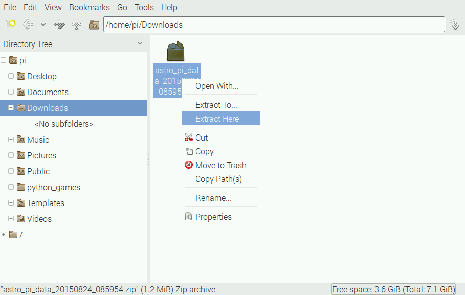
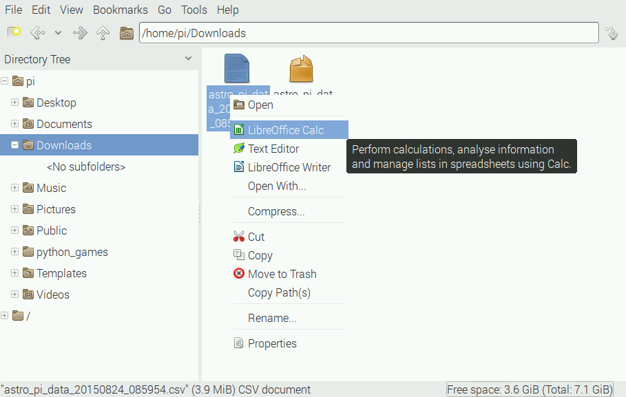
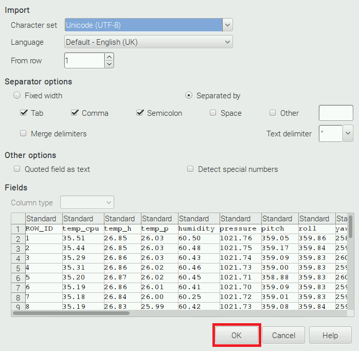
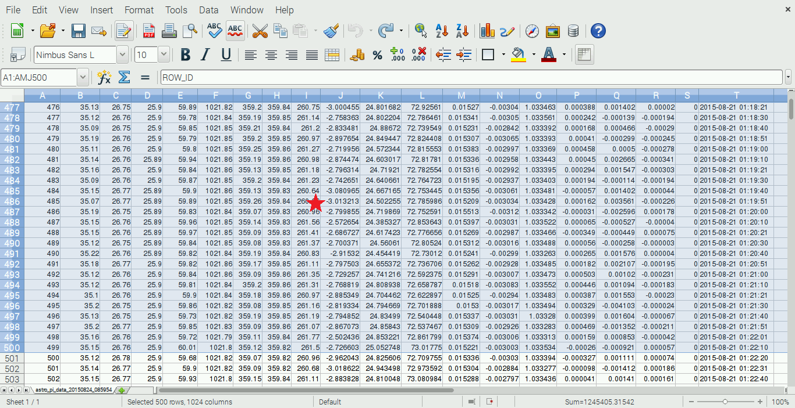
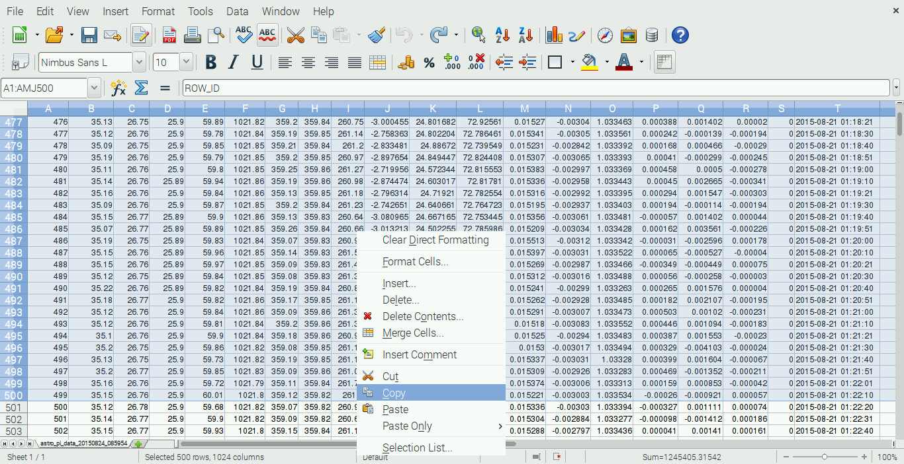
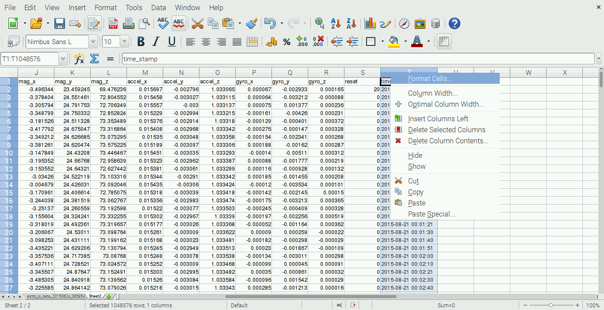
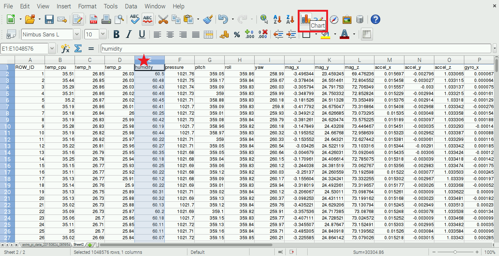
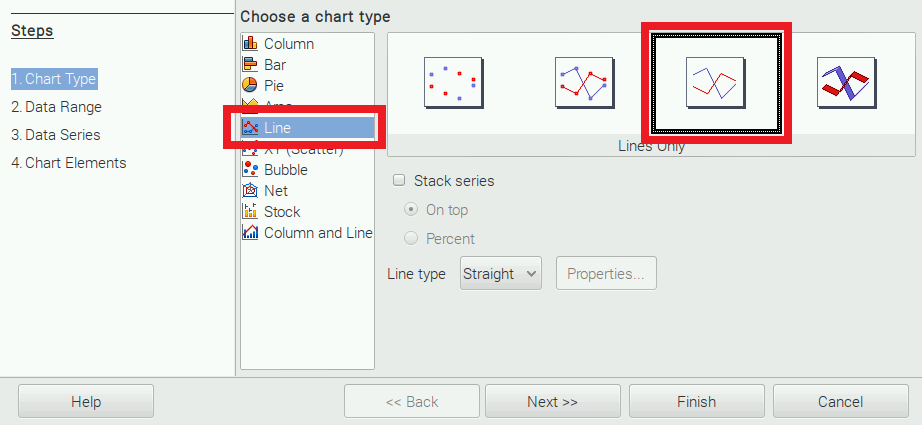
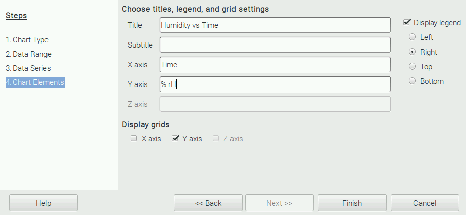
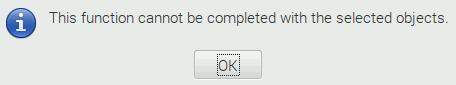

# Worked Example

There are so many different spreadsheet applications that we couldn't possibly provide guides for them all. So we've provided a worked example for how to get analysing using some free software called [Libre Office](https://www.libreoffice.org/) that's preinstalled on the Raspberry Pi operating system (Raspbian).

## Raspbian

Before doing anything it's advisable to [download](https://www.raspberrypi.org/downloads/) the latest version of Raspbian *Jessie* and install it on your SD card. If you need help with this please read our [NOOBS setup guide](https://www.raspberrypi.org/help/noobs-setup/). Note that the video shows Raspbian *Wheezy* being installed, the Wheezy version is now out of date and does not come with Libre Office, Jessie does.

Boot up your Raspberry Pi as per usual using your new Raspbian Jessie SD card.

## Download the CSV zip file

Currently only the example data is available. This data was *not* recorded in space, it was captured at an office desk in Cambridge. So please do not spend too much effort analysing it, it's only been provided so that you can examine the file layout and check that you can load it properly. The file you'll get from the ISS will use the same format and layout.

[Example CSV Download](https://github.com/raspberrypilearning/astro-pi-flight-data-analysis/blob/master/data/astro_pi_data_20150824_085954.zip?raw=true)

After downloading the zip file, open the *File Manager* application and navigate to the `Downloads` folder. The zip file should be shown on the right:

Right click on the zip file and select `Extract Here` from the context menu.

The CSV file containing the data should now appear.

## Load the CSV into Libre Office

Right click on the CSV file and select `LibreOffice Calc` from the context menu.

The following dialogue will show. This allows you to configure how Libre Office Calc should import the data, the default options are fine so just click the OK button.

The data will now show in the usual tabular spreadsheet layout.

## Copy data to work on

It is likely that the CSV file will contain upward of 30 thousand rows, possibly more depending on how long Tim Peake leaves the Astro Pis in flight recorder mode. This amount of data can cause Libre Office Calc to run *very slowly*. Especially when producing graphs (this will be very noticeable if you're using older models of the Raspberry Pi). So, for the purposes of this exercise, we're going to select the first 500 rows and copy them into a new spreadsheet to work on.

Start by clicking in the margin (where the red star is below) to select an entire row. Then hold down the shift key and use the cursor keys down arrow to select more rows.

Keep going until you reach the 500th row.

Then right click on the selected row (for instance where the red star is above) and select `Copy` from the context menu.

Click on the green `+` symbol at the bottom of the program to create a new blank sheet.

From the `Edit` menu at the top, select `Paste`

The copied data should then appear.

Working with only 500 rows will be a lot quicker and more responsive allowing you to get to grips with Libre Office Calc without having long processing delays between each step.

## Format the time stamp column

Currently the time stamp column is a *text* field. If you want to use this in any calculations (for instance working out the time between two rows) then you'll need to format the entire column as *time* field. So let's do this now before we go any further.

Scroll to the right and find column `T` which should be `time_stamp`, right click on the column header and select `Format Cells` from the context menu.

On the Numbers tab select `Time` under `Category` and then under `Format` choose the last option in the list that says `1999-12-31 13:37:46`

Check that the format code is the same as in the picture above, then click OK.

## Plot humidity

To gain some familiarity with making charts we're going to do humidity versus time, let's say we are looking for crew activity near the Astro Pis. Feel free to use a different sensor if you prefer. Time will be on the horizontal X axis and the humidity measurement will be on the vertical Y axis. Scroll back to the left and find column `E` which should be `humidity`, left click on the column header (where the red star is below) to select all rows in the column.

Then click the `Chart` button in the toolbar.

The Chart Wizard will now show. Under `Chart Type` select `Line` followed by `Lines Only`, now select step 3 (Data Series) from the left hand menu.

Under `Data series` `humidity` should be selected, under `Data ranges` select `Y-Values`. You'll now see that the `Categories` box is empty. This box allows you to specify the corresponding horizontal X-axis values for the humidity on the Y-axis.

We saw from before that the time stamp data is in column `T` so enter the following to specify rows 2 to 500: `$Sheet2.$T$2:$T$500` and click Next.

Step 4 (Chart Elements) just allows you to specify titles for the axes and for the chart itself, you can skip this if you want to.

When you're ready click Finish.

## Examine the chart

You can expand the chart by clicking and dragging the resize zones on the edges and corners.

Notice that the Y axis doesn't start at zero, so even though it looks like the relative humidity is changing a lot here it's only varying by around 3%. Which isn't that much. This is what you might expect at an office desk over the course of an hour or so though.

## Deleting charts

If you're not happy with how a chart has come out you might want to delete it and try again. To delete a chart you simply select it and press the `Delete` key on your keyboard.

If you see the error message above it's because you still have the column selected in addition to the chart. To handle this just click on any cell in the spreadsheet and then reselect the chart before trying to delete it again.

## Add more data

Let's say you now wanted to look for CHX dry-outs and want both temperature and humidity on the same chart. The process is essentially the same as before however instead of only selecting one column at the start, you hold down the `Ctrl` key and select as many as you like before clicking the `Chart` button.

This time the Y axis does start from zero meaning that you're seeing a much more accurate depiction of the measurements. Once you feel confident you can go back to the original CSV data and try to load more than 500 rows into a chat. Be wary of doing this for all rows as it will be very slow!

Good luck!

[< Back to the worksheet](worksheet.md#how-do-i-analyse-the-data)
