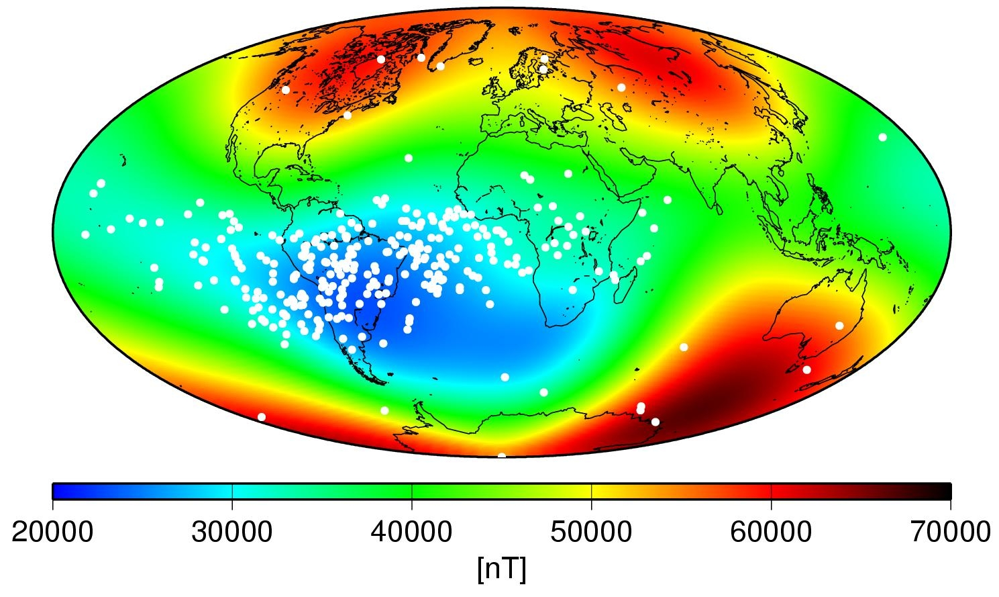

# Astro Pi Flight Data Analysis

Do strange, unexplained things happen on the International Space Station? With this resource you can help us find out. The Astro Pis (above) will be watching...

The two Astro Pis on the ISS are programmed to run the competition [winning programs](http://astro-pi.org/competition/winners/) as part of an automatic sequence.  Each winning program will have one week of run time. After this sequence has completed the Astro Pis will enter a flight recorder mode where they save sensor readings to a database every 10 seconds. If anything strange happens it will be recorded!

Because the sensor readings are taken so often there will be masses of data to search through, so we need **your** help to look through the data and find out what was going on. This could be strange unexplained things or just the normal day to day activites of the astronauts.

We anticipate the Astro Pis will be left in this mode for at least a week, probably more. The product of this will be several large CSV files, created by Tim, which **you can download** and analyse. To help you get started with this we have obtained some example sensor readings from the ISS life support system. These show what certain activities will look like, when ploted on a graph, so that you can look for something similar in the Astro Pi data.

## What are CSV files?

CSV stands for comma separated values ([more info](https://en.wikipedia.org/wiki/Comma-separated_values)). It's a very old file format used for storing tables of information as plain text. So in some ways it's very similar to an Excel spreadsheet but more basic with less features.

You can load a CSV file with any spreadsheet program, such as:

- Microsoft Excel
- Libre Office Calc
- Open Office Calc
- Google Sheets
- Lotus 1-2-3

## What will be in the CSV files?

The CSV file will contain sensor measurements in rows and columns. The columns each represent a different type of sensor with an extra column to record a time stamp. Each *row* gives you a reading for every sensor with the time stamp showing when the readings were taken. So you can essentially use this to look at how the sensor readings are changing over time.

Here is an example:

ROW_ID|SENSOR 1|SENSOR 2|SENSOR 3|SENSOR 4|...|TIME STAMP
---|---|---|---|---|---|---
1|35.29|26.86|26.03|60.43|...|01/01/2015 23:58:50
2|35.31|26.86|26.02|60.46|...|01/01/2015 23:59:00
3|35.2|26.87|26.02|60.45|...|01/01/2015 23:59:10

So all measurements on a single row were taken at the time shown in the time stamp. Also note that they are each ten seconds apart. The CSV file you'll get from orbit thankfully won't have Sensor 1, 2 or 3 but more intuitive names that self describe the data.

Here is a list of the columns you'll have:

Column name|Meaning|Source
---|---|---
ROW_ID|A unique identifying number for each row. If you're collaborating with other people it may be useful to have a way to specify the exact row number when you find something interesting in the data.|Database auto increment.
temp_cpu|The temperature of the Raspberry Pi B+ CPU in degrees *Celsius*.|Raspberry Pi GPU mailbox (`/sys/class/thermal/thermal_zone0/temp`).
temp_h|The temperature in degrees *Celsius*.|Sense HAT Humidity sensor.
temp_p|The temperature in degrees *Celsius*.|Sense HAT Pressure sensor.
humidity|The *percent* relative humidity.|Sense HAT Humidity sensor.
pressure|Air pressure in *Millibars*.|Sense HAT Pressure sensor.
pitch|An angle between 0 and 360 *degrees* giving the current pitch orientation.|Calculated from combined Sense HAT accel, gyro and mag readings. 
roll|An angle between 0 and 360 *degrees* giving the current roll orientation.|Calculated from combined Sense HAT accel, gyro and mag readings.
yaw|An angle between 0 and 360 *degrees* giving the current yaw orientation.|Calculated from combined Sense HAT accel, gyro and mag readings.
mag_x|The magnetic field stength of the X axis in *microteslas* (µT).|Sense HAT magnetometer.
mag_y|The magnetic field stength of the Y axis in *microteslas* (µT).|Sense HAT magnetometer.
mag_z|The magnetic field stength of the Z axis in *microteslas* (µT).|Sense HAT magnetometer.
accel_x|The acceleration intensity of the X axis in *Gs*.|Sense HAT accelerometer.
accel_y|The acceleration intensity of the Y axis in *Gs*.|Sense HAT accelerometer.
accel_z|The acceleration intensity of the Z axis in *Gs*.|Sense HAT accelerometer.
gyro_x|The rotational intensity of the X axis in *radians per second*.|Sense HAT gyroscope.
gyro_y|The rotational intensity of the Y axis in *radians per second*.|Sense HAT gyroscope.
gyro_z|The rotational intensity of the Z axis in *radians per second*.|Sense HAT gyroscope.
reset|A copy of the Raspberry Pi CPU reset register. This is useful for looking at the frequency and effect of single event upsets. The values is only recorded once per boot.|Raspberry Pi GPU mailbox (`vcgencmd get_rsts`).
time_stamp|The time at which the sensors were measured and the row was created.|Astro Pi real time clock.

There is an excillent guide to help you understand the sensors [here](https://www.raspberrypi.org/learning/astro-pi-guide/) if you need to familiarise yourself.

## When can I get the CSV files?

Several things need to happen before the files will be available. Tim needs to get to the ISS and deploy the Astro Pi computers (his launch date is December 15th 2015). Once deployed they need to complete the processing of the programs that won the Astro Pi Competition, each one has a week of run time allocated. Only then will the Astro Pis enter flight recording mode where this data will be captured.

Then after another week, or possibly longer, Tim will download the CSV files and we will make them available on the Astro Pi website. Keep checking back for [updates](http://astro-pi.org/updates/). So, currently, it is not possible for us to provide an exact date since Tim's on orbit schedule is not known to us. We anticipate it will be in February or March 2016 though.

## Example CSV file

To test you can load this kind of file try downloading this example, it's inside a zip file which you will need to extract first.

[Download](data/astro_pi_data_20150824_085954.zip?raw=true)

If you need help loading the file we suggest to search the Internet for help specifically related to the spreadsheet software you're using.

## How do I analyse the data?

- Short answer

  Any way you like!

- Long answer

  There is no single correct way, there are many ways you can go about it. The easiest way though is to choose one or two sensors and use the *chart* function of your spreadsheet software to plot their columns on a line graph against the time stamp. Then just visually inspect the lines for sudden, drastic or gradual changes. Try to think about what would be causing them.
  
  If you need help here just go onto [YouTube](https://www.youtube.com/) and search for *how to plot a line graph in excel* for example.
  
  Here is a [worked example](spreadsheet.md) using Libre Office Calc on the Raspberry Pi.
  
  You could also look into using analytical software packages like [Mathematica](https://www.wolfram.com/mathematica/) or [MATLAB](http://uk.mathworks.com/), both of which are free on the Raspberry Pi. It may be possible to produce some really interesting visualisations of the data using these.
  
  The time stamp column could also be used to [look up](http://www.isstracker.com/historical) the location of the ISS to add a geographical dimension to your analysis. There will be enough data to give you good global coverage and you may be able to show that some sensor readings are affected by the location of the station.
  
  You could even write code to automatically search for interesting or anomalous readings to speed up the process.

## What to look for

Courtesy of the [German Aerospace Center](http://www.dlr.de/) and the [UK Space Agency](https://www.gov.uk/government/organisations/uk-space-agency) we have obtained some example sensor readings from the ISS life support system. These show what certain human activities will look like, when ploted on a graph, so that you can look for something similar in the Astro Pi data.

### Crew activity

Hard work is part of daily life in space for astronauts. Their bodies naturally radiate heat and through perspiration or breathing they release moisture into the air that increases relative humidity. Because of this [humidity](https://www.raspberrypi.org/learning/astro-pi-guide/sensors/humidity.md) and [temperature](https://www.raspberrypi.org/learning/astro-pi-guide/sensors/temperature.md) are two great indicators of crew activity. The graph below shows the crew deploying the Muscle Atrophy Research and Exercise System ([MARES](http://www.esa.int/Our_Activities/Human_Spaceflight/Columbus/Muscle_Atrophy_Research_and_Exercise_System)) in the Columbus module (a big zero-g exercise machine).

Time is on the horizontal axis with relative humidity on the vertical. They start working at 9:00 and you can see that relative humidity starts to increase. They go on their lunch break at about 12:30. Some more work starts around 16:30.

The next graph shows the temperature for the same activity, you can see there is some variation around the time when the crew are working however the change is only minor at less than one degree. So you should perhaps consider temperature as a less reliable indicator of crew activity.

Time is on the horizontal axis with temperature on the vertical.

### CHX Dry-Outs

CHX stands for Cabin Heat Exchanger, this is a machine that's responsible for keeping the internal temperature of the ISS comfortable for the crew to live and work in. The CHX *core* is a consumable item that needs to be replaced once every six weeks or so. Because the core has water flowing through it constantly; regular dry-outs are required to prevent microbial or fungal growth that could damage the machine or pose a health risk to the crew. So a *CHX dry-out* is the name of the maintenance activity where they change from one CHX core to the next.

During this maintenance the water flowing through the CHX core is diverted to a backup unit to allow the core to dry out so that it can be replaced. This causes a drop in cabin [temperature](https://www.raspberrypi.org/learning/astro-pi-guide/sensors/temperature.md), that reduces how much moisture can be suspended in the air, which in turn increases relative [humidity](https://www.raspberrypi.org/learning/astro-pi-guide/sensors/humidity.md). The temperature plot below shows the dry-out starting at about 07:45.

Time is on the horizontal axis with temperature on the vertical.

At the same time a marked increase in relative humidity is recorded due to the cooler air being less able to suspend water vapour. Time is on the horizontal axis with relative [humidity](https://www.raspberrypi.org/learning/astro-pi-guide/sensors/humidity.md) on the vertical.

Note how long it takes for the measurements to get back to normal. These events should be easy to spot in the data if you look at temperature and humidity together. The plot below also shows [dew point](https://en.wikipedia.org/wiki/Dew_point) which you can calculate (if you want to) using this simple [formula](https://en.wikipedia.org/wiki/Dew_point#Simple_approximation).

### O2 Re-pressurisation 

This is where they top-up the oxygen supply on board the ISS. An O2 re-pressurisation is also regular maintenance activity that occurs once every few months. The ISS has an oxygen recycling and carbon dioxide scrubbing system however periodically a bottle of compressed oxygen is delivered to the ISS on a [Progress](https://en.wikipedia.org/wiki/Progress_%28spacecraft%29) cargo vehicle. This is then connected to the life support system and slowly released to *top-up* the oxygen in the ecosystem over the course of an hour or two.

When this happens an increase in atmospheric pressure is recorded as well as in O2 content of the air. The Sense HAT cannot measure O2 content but it can measure air [pressure](https://www.raspberrypi.org/learning/astro-pi-guide/sensors/pressure.md), so you should be able to identify when these re-pressurisation events occur in the CSV data.

The first graph below shows O2 content in the air, however the second one shows total air pressure. Time is on the horizontal axis with *millimeters of mercury* on the vertical. Note that the pressure data in the CSV files will be in *millibars* since this is the unit used by the Sense HAT.

**1 atmosphere = 760 millimeters of mercury = 1013.25 millibars**

### ISS Re-boost

The ISS is always losing 50 to 100 meters of altitude per day and if left unchecked it would eventually re-enter the atmosphere and burn up like a meteorite! This happens because the ISS is in low Earth orbit (LEO) and even at the huge altitude of 400 km there is still a tiny amount of atmosphere present. That air creates drag on the ISS which causes its orbit to slowly decay over time.

To avoid it burning up (or rather to keep on delaying it) the ISS is regularly given a re-boost by a docked spacecraft. A reboost is just firing the thrusters for a while to increase the altitude by the desired amount.

The graph below shows time on the horizontal axis and the altitude of the ISS in kilometres on the vertical. You can see that, every now and again, the altitude jumps back up. These are the reboosts and you can see they happen in a somewhat irregular way. On the whole one or two occur per month.

The Astro Pi cannot measure altitude from inside the ISS so this will not be part of the CSV data. However when an ISS reboost occurs it will be able to detect the force of **acceleration** being applied by the spacecraft thrusters. In microgravity the accelerometer X, Y and Z axis should always read close to zero Gs. However at least one or two axes will detect some force when the thrusters are being fired.

The crew say that they can feel when a reboost is happening so the Sense HAT [accelerometer](https://www.raspberrypi.org/learning/astro-pi-guide/sensors/movement.md) should definitely be able to detect it. Therefore you should be able to work out when ISS reboosts occurred and how long they lasted. Go [here](http://www.heavens-above.com/IssHeight.aspx) for the latest altitude graph, you may be able to correlate this with the data in the CSV files.

### South Atlantic Anomaly

High above the Earth there is a layer of energetic charged particles trapped by the Earth's magnetic field. Most of these originate from the solar wind (matter ejected into space by the sun) and some are from cosmic rays. The layer begins at an altitude of about 1000 kilometres and goes up to around 60,000 kilometres. It's known as the [Van Allen radiation belt](https://en.wikipedia.org/wiki/Van_Allen_radiation_belt) because the levels of radiation inside it are hazardous to satellites and spacecraft. So anything orbiting inside this belt needs to employ radiation shielding to be able to survive for a significant length of time.

The [South Atlantic Anomaly](https://en.wikipedia.org/wiki/South_Atlantic_Anomaly) is an area where the Van Allen radiation belt dips down to an altitude of just 200 kilometres above the Earth's surface. Meaning that satellites in low Earth orbit experience higher than usual levels of radiation when passing through it. This includes the International Space Station.

This radiation interferes with electronic equipment and can bit-flip computer memory (change the state of a single binary bit from a `0` to a `1` or from a `1` to a `0`) causing what's known as a [single event upset](https://en.wikipedia.org/wiki/Single_event_upset) crash. The white spots on this map indicate where electronic equipment on the [TOPEX/Poseidon](https://en.wikipedia.org/wiki/TOPEX/Poseidon) satellite was affected in this way. The darker blue area is the South Atlantic Anomaly. Note the scale is in nanoteslas (nT) whereas the magnetometer values in the CSV data will be in microteslas (µT). 1 µT is equal 1000 nT.

Using the magnetometer X, Y and Z data from the CSV files along with the time stamp (to look up latitude and longitude) you should be able to reproduce a heat map of the Earth's magnetic field strength like the one above. Then using the **reset** column (the Raspberry Pi reset register) you'll be able to plot where the Astro Pi experienced an upset and find out if it's being affected by the South Atlantic Anomaly.

The Astro Pi will just reboot if it gets a single event upset. The **reset** field will only have data in the *first row created after each boot* of the Astro Pi, at all other times it will be `0`. The number `1000` means the Astro Pi has booted up from cold, `20` means it's come back up after a reboot. Other numbers indicate that the Astro Pi has come up in a stange state and may not be working correctly.

## What to do when you find something

We'll be trying to collectively map out what we think was happening throughout the entire time the flight recorder mode was active. So to contribute to this please go to the [Astro Pi forums](https://www.raspberrypi.org/forums/viewforum.php?f=104) and write a new post explaining your findings. This will then be verified by one of the team at Raspberry Pi and other members of the public.

Good luck!

## What next?

How about capturing some flight recording data of your own? This will allow you to recreate what the Astro Pis in space will be doing in your own classroom! When you feel you're ready to give this a try there is an excellent resource on data logging [here](https://www.raspberrypi.org/learning/sense-hat-data-logger/) which you can follow to do this.
