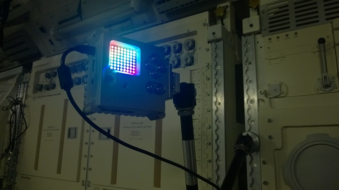
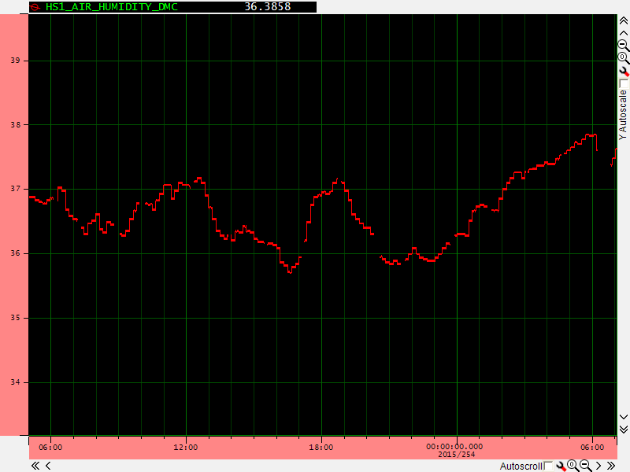
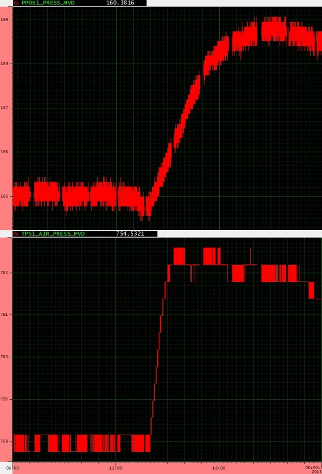

# Astro Pi Flight Data Analysis

The two Astro Pi flight computers on board the ISS are programmed to run the competition [winning programs](http://astro-pi.org/competition/winners/) as part of an automatic sequence.  Each program will have one week of run time. After this sequence has completed the Astro Pis will enter a flight recorder mode where they save sensor readings to a database every 10 seconds.

Because the sensor readings are being taken so frequently you'll be able to analyse them to look for lots of interesting activity on the station and possibly strange anomalies that Tim will want to know about!

We anticipate the Astro Pis will be left in this mode for at least a week, probably more. The product of this will be several large CSV files, created by Tim, which **you can download** and analyse. To help you get started with this we have obtained some example sensor readings from the ISS life support system. These show what certain activities will look like, when ploted on a graph, so that you can look for something similar in the Astro Pi data.

## What are CSV files?

CSV stands for comma separated values ([more info](https://en.wikipedia.org/wiki/Comma-separated_values)). It's a very old file format used for storing tables of information as plain text. So in some ways it's very similar to an Excel spreadsheet but more basic with less features.

You can load a CSV file with any spreadsheet program, such as:

- Microsoft Excel
- Libre Office Calc
- Open Office Calc
- Google Sheets
- Lotus 1-2-3

## What will be in the CSV files?

The CSV file will contain sensor measurements in rows and columns. The columns each represent a different type of sensor with an extra column to record a time stamp. Each *row* gives you a reading for every sensor with the time stamp showing when the readings were taken. So you can essentially use this to look at how the sensor readings are changing over time.

Here is an example:

ROW_ID|SENSOR 1|SENSOR 2|SENSOR 3|SENSOR 4|...|TIME STAMP
---|---|---|---|---|---|---
1|35.29|26.86|26.03|60.43|...|01/01/2015 23:58:50
2|35.31|26.86|26.02|60.46|...|01/01/2015 23:59:00
3|35.2|26.87|26.02|60.45|...|01/01/2015 23:59:10

So all measurements on a single row were taken at the time shown in the time stamp. Also note that they are each ten seconds apart. The CSV file you'll get from orbit thankfully won't have Sensor 1, 2 or 3 but more intuitive names that self describe the data.

Here is a list of the columns you'll have:

Column name|Meaning|Source
---|---|---
ROW_ID|A unique identifying number for each row. If you're collaborating with other people it may be useful to have a way to specify the exact row number when you find something interesting in the data.|Database auto increment.
temp_cpu|The temperature of the Raspberry Pi B+ CPU in degrees *Celsius*.|Raspberry Pi GPU mailbox.
temp_h|The temperature in degrees *Celsius*.|Sense HAT Humidity sensor.
temp_p|The temperature in degrees *Celsius*.|Sense HAT Pressure sensor.
humidity|The *percent* relative humidity.|Sense HAT Humidity sensor.
pressure|Air pressure in *Millibars*.|Sense HAT Pressure sensor.
pitch|An angle between 0 and 360 *degrees* giving the current pitch orientation.|Calculated from combined Sense HAT accel, gyro and mag readings. 
roll|An angle between 0 and 360 *degrees* giving the current roll orientation.|Calculated from combined Sense HAT accel, gyro and mag readings.
yaw|An angle between 0 and 360 *degrees* giving the current yaw orientation.|Calculated from combined Sense HAT accel, gyro and mag readings.
mag_x|The magnetic field stength of the X axis in *microteslas* (µT).|Sense HAT magnetometer.
mag_y|The magnetic field stength of the Y axis in *microteslas* (µT).|Sense HAT magnetometer.
mag_z|The magnetic field stength of the Z axis in *microteslas* (µT).|Sense HAT magnetometer.
accel_x|The acceleration intensity of the X axis in *Gs*.|Sense HAT accelerometer.
accel_y|The acceleration intensity of the Y axis in *Gs*.|Sense HAT accelerometer.
accel_z|The acceleration intensity of the Z axis in *Gs*.|Sense HAT accelerometer.
gyro_x|The rotational intensity of the X axis in *radians per second*.|Sense HAT gyroscope.
gyro_y|The rotational intensity of the Y axis in *radians per second*.|Sense HAT gyroscope.
gyro_z|The rotational intensity of the Z axis in *radians per second*.|Sense HAT gyroscope.
reset|A copy of the Raspberry Pi CPU reset register. This is useful for looking at the frequency and effect of single event upsets. The values is only recorded once per boot.|Raspberry Pi GPU mailbox.
time_stamp|The time at which the sensors were measured and the row was created.|Astro Pi real time clock.

There is an excillent guide to help you understand the sensors [here](https://www.raspberrypi.org/learning/astro-pi-guide/) if you need to familiarise yourself.

## When can I get the CSV files?

Several things need to happen before this data will be available. Tim needs to get to the ISS and deploy the Astro Pi computers (his launch date is December 15th). Once deployed they need to complete the processing of the programs that won the Astro Pi Competition, each one has a week of run time allocated. Only then will the Astro Pis enter flight recording mode where this data will be captured.

Then after another week, or possibly longer Tim will download the CSV file and we will make it available on the Astro Pi website. Keep checking back for [updates](http://astro-pi.org/updates/). So, currently, it is not possible for us to provide an exact date since Tim's on orbit schedule is not known to us. We anticipate it will be in February or March 2016 though.

## Example CSV file

To test you can load this kind of file try downloading this example, it's inside a zip file which you will need to extract first.

[Download](data/astro_pi_data_20150824_085954.zip?raw=true)

If you need help loading the file we suggest to search the Internet for help specifically related to the spreadsheet software you're using.

## How do I analyse the data?

- Short answer

  Any way you like!

- Long answer

  There are many ways you can go about it. The easiest way is to choose one or two sensors and use the *chart* function of your spreadsheet software to plot their columns on a line graph against the time stamp. Then just visually inspect the lines for sudden, drastic or gradual changes. Try to think about what would be causing them.
  
  If you need help here just go onto [YouTube](https://www.youtube.com/) and search for *how to plot a line graph in excel* for example.
  
  You could also look into using analytical software packages like [Mathematica](https://www.wolfram.com/mathematica/) or [MATLAB](http://uk.mathworks.com/), both of which are free on the Raspberry Pi. It may be possible to produce some really interesting visualisations of the data using these.
  
  The time stamp column could also be used to [look up](http://www.isstracker.com/historical) the location of the ISS to add a geographical dimension to your analysis. There will be enough data to give you good global coverage and you may be able to show that some sensor readings are affected by the location of the station.

## What to look for

### Crew activity near the Astro Pi

### CHX Dry Outs

### O2 Re-pressurisation 

### ISS Re-boost

### South Atlantic Anomaly

## What to do when you find something

